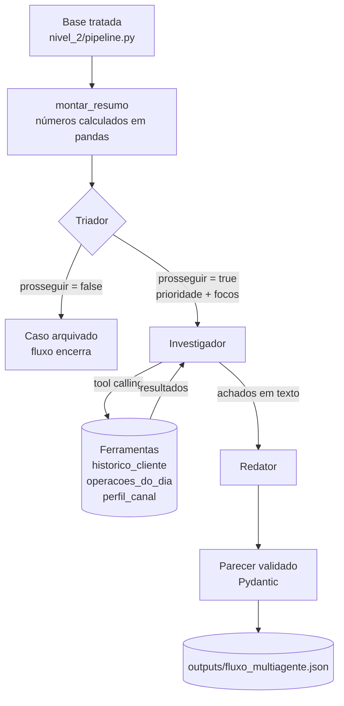

# Arquitetura — Fluxo multiagente (Nível 3, trilha A)

## Diagrama



## Os três papéis

| Papel | Entrada | Saída | Decide |
|---|---|---|---|
| **Triador** | resumo do cliente | `prosseguir`, `prioridade`, `focos` | se o caso segue |
| **Investigador** | resumo + focos | achados em texto | quais ferramentas chamar |
| **Redator** | resumo + triagem + achados | parecer estruturado | nível de risco e tipologia |

## Estado compartilhado

Um único dicionário atravessa os três papéis, acumulando o que cada um produziu:

```python
{
  "cliente_id": str,
  "modelo": str,
  "resumo": dict,          # produzido em pandas, antes do fluxo
  "triagem": dict | None,  # preenchido pelo Triador
  "investigacao": {"ferramentas": [...], "achados": str},
  "parecer": dict | None,  # preenchido pelo Redator
  "encerrado_em": "triador" | "redator" | "erro",
  "tokens": int,
  "latencia_s": float,
}
```

Nenhum papel lê variável global nem chama outro diretamente — cada um recebe o
estado, acrescenta sua parte e devolve. Isso torna o fluxo testável papel a papel.

## Condição de parada

O Triador pode encerrar o fluxo devolvendo `prosseguir: false`. O caso é marcado
como arquivado e **não chega** ao Investigador nem ao Redator, economizando as
chamadas seguintes. O campo `encerrado_em` registra onde cada caso terminou.

Há também um limite de `MAX_RODADAS = 4` no loop de ferramentas do Investigador,
para impedir consulta indefinida.

## Divisão entre cálculo e interpretação

Todo número que os três papéis veem foi calculado em pandas — no `pipeline.py`
(limpeza e regras) ou nas ferramentas do `tools.py` (agregações de consulta).
Nenhum dos papéis soma, compara com limiar ou calcula mediana. O Triador decide
prioridade, o Investigador decide o que olhar, o Redator decide como classificar e
redigir.
